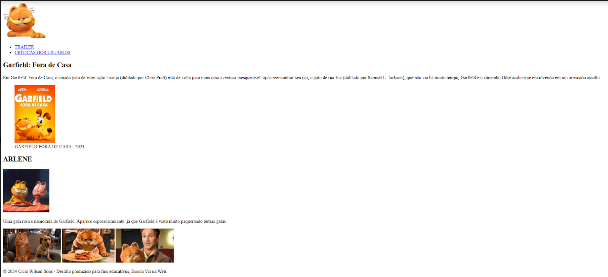

# Desafio 1 - Criação de Página Web - Estrutura de Tags e Semântica
#### Prof: Karynne Moreira - Data: 8 de nov. de 2024
#### Data de entrega: 18 de nov., 23:59

Objetivo: Desenvolver uma estrutura de página HTML utilizando as tags semânticas corretas para organizar um conteúdo sobre o filme. A página deve conter cabeçalho, conteúdo principal e rodapé, conforme os requisitos descritos abaixo.Instruções:

## Cabeçalho:
Utilize a tag semântica apropriada para criar o cabeçalho da página, incluindo:

* Insira o logo do filme no canto superior esquerdo.
* Inclua uma barra de navegação com links para as principais seções da página.

## Conteúdo Principal:
O conteúdo da página deve ser estruturado com as tags semânticas adequadas para refletir os seguintes elementos:

* O título do filme
* Escreva uma breve sinopse do filme
* Insira uma imagem do pôster do filme com uma legenda descrevendo a imagem
* Escreva um artigo com mais detalhes sobre o filme, incluindo (Subtítulo, Imagem e texto):
* Crie uma galeria com imagens do filme, sem legendas

## Rodapé: 
Utilize a tag semântica para criar o rodapé da página, incluindo:

* Insira uma mensagem de direitos autorais, como “© 2024 Nome do Estúdio. Todos os direitos reservados”.

### Materiais de Apoio:
* Disponibilizamos um arquivo no Figma com um protótipo da página que pode ser utilizado como guia para a organização do conteúdo: [figma](https://www.figma.com/design/iYneECletzSjszJDpBGM6Z/WS---SEM%C3%82NTICA?node-id=0-1&node-type=canvas&t=f5TeReK8MxRJ3qSa-0)

* As imagens necessárias para o desafio estarão disponíveis para que possam ser utilizadas no desenvolvimento da página.

### Forma de Entrega:
* O código deve ser enviado pelo , em um repositório público. Lembre-se de que o repositório precisa conter todos os arquivos HTML e imagens utilizados no projeto.

## Layout

<figure>
    
    <figcation>Layout da Página</figcatption>
</figure>